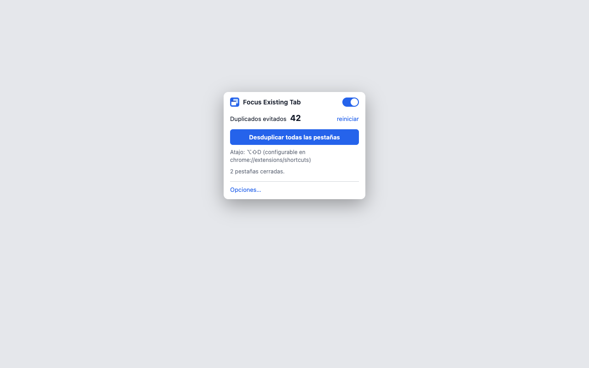

<p align="center">
  
</p>

<h1 align="center">Focus Existing Tab</h1>

<p align="center">
  When you open a URL that is already open in another tab, focus that tab instead of loading it again.
</p>

<p align="center">
  <a href="https://github.com/alvaromr/focus-existing-tab/actions/workflows/ci.yml"></a>
  
  
  <a href="LICENSE"></a>
</p>

Extension for Chrome, Chromium and Brave. It catches the navigation before the duplicate page
starts loading, jumps to the tab that already shows it (in any window) and closes the new one.
No servers, no analytics, no remote code.

<p align="center">
  
</p>

## Features

- **Never loads twice**: acts on `webNavigation.onBeforeNavigate`, the earliest event with a URL.
- **Whitelist and blacklist** with glob patterns and regular expressions.
- **Query parameters**: ignore `utm_*`, `fbclid`, `gclid`… or mark the ones that matter, globally
  or per site.
- **Normalization**: `#fragment`, `www.`, `http/https`, trailing slash, port, letter case,
  parameter order.
- **Scope**: all windows or the current one, tab groups, incognito, app windows (PWAs).
- **Configurable priority** when choosing which tab to focus (same window, active, pinned…).
- **Protected pinned tabs**, "focus only" mode, go back on in-tab navigations.
- **Deduplicate all tabs** from the popup or with `Alt+Shift+D`; toggle with `Alt+Shift+F`.
- **Counter** of avoided duplicates on the icon, **JSON import/export**, **contextual help** on
  every option. UI in English and Spanish.

## Installation

Distributed through GitHub Releases, not the Chrome Web Store. Install in developer mode:

1. Download and unzip the [latest release](https://github.com/alvaromr/focus-existing-tab/releases)
   (or clone the repository).
2. Open `chrome://extensions` (Brave: `brave://extensions`) and enable **Developer mode**.
3. Click **Load unpacked** and pick the folder containing `manifest.json`.
4. Optional: pin the icon to the toolbar to keep the popup at hand.

Shortcuts can be changed at `chrome://extensions/shortcuts`. If you use another duplicate-tab
extension, disable it: two extensions acting on the same navigation step on each other.

## Usage

It works out of the box with the defaults. The **popup** toggles the extension, shows the counter
and deduplicates every open tab. The **options** page holds the lists, normalization, parameters,
priority, a URL tester that shows what the extension would do with any address, and
configuration import/export.

The full guide to every option and to the behaviour in each case is in
[docs/CONFIGURATION.md](docs/CONFIGURATION.md).

## Permissions and privacy

| Permission      | Purpose                                                                        |
| --------------- | ------------------------------------------------------------------------------ |
| `tabs`          | Read the URLs of open tabs, activate the existing one and close the duplicate. |
| `webNavigation` | Learn about every navigation before it loads.                                  |
| `storage`       | Save the configuration (`sync`) and the counter (`local`).                     |

It injects no code into pages and makes no network requests. URLs are only read in memory during
a navigation. Details in [PRIVACY.md](PRIVACY.md).

## Development

Plain JavaScript with ES modules, no build step. Node 26 (pinned in `.node-version`; minimum 22)
and pnpm.

```bash
pnpm install     # development tooling only
pnpm check       # lint + typecheck + tests with coverage (what CI runs)
pnpm test:e2e    # real run in headless Chromium
pnpm package     # dist/focus-existing-tab-<version>.zip
```

Architecture, tests, CI, security review, manual test plan and releases in
[docs/DEVELOPMENT.md](docs/DEVELOPMENT.md). Changes per version in [CHANGELOG.md](CHANGELOG.md).

## License

[MIT](LICENSE) © Álvaro Martín
